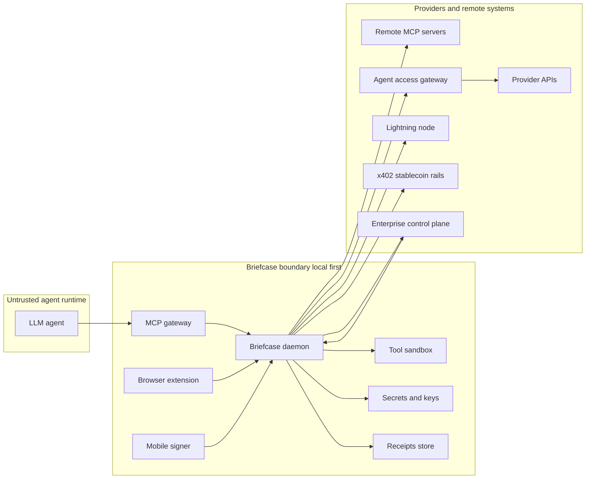
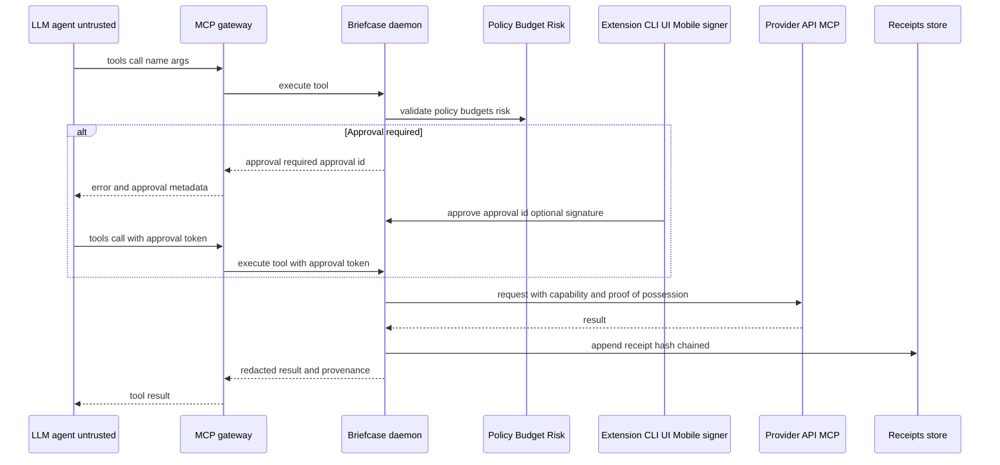
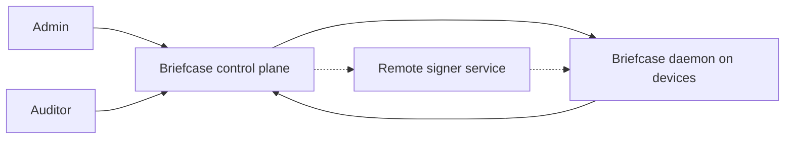

# Agentic Auth

Agentic Auth is a production-grade, open-source reference implementation of an **authentication and authorization boundary for tool-using LLM agents**.

Core properties:

- **The agent runtime is untrusted** (prompt-injectable; tool output is untrusted).
- **Raw secrets never cross the agent boundary** (OAuth refresh/access tokens, capability tokens, private keys, payment proofs).
- The agent connects to **one MCP server** (`mcp-gateway`) which routes all tool calls through a local (or enterprise-managed) **daemon** (`briefcased`).
- Every tool call is **schema validated**, **policy/budget gated**, **sandboxed**, and **audited** with tamper-evident receipts.

This repo answers: "How do I let agents use powerful tools, OAuth, paid APIs, and remote MCP servers without giving them credentials or a blank check?"

## What "Agentic Auth" Means Here

Traditional auth assumes the caller is trusted enough to hold credentials. Agents are not.

In this system, agentic auth is the end-to-end flow where:

1. The agent emits an **intent** (`tools/call name args`) to a single MCP surface.
2. A trusted daemon:
   - validates tool inputs against a strict JSON Schema
   - evaluates allow/deny policy, budgets, and non-authoritative risk scoring
   - requests explicit approval when required (optionally with a strong signer)
   - obtains or mints a **short-lived, caveated capability** (OAuth/VC/payments behind the boundary)
   - binds high-value capabilities to a proof key (DPoP / PoP) and enforces replay defenses
3. The daemon executes the outbound request and returns a **redacted result** plus **provenance** and a **receipt**.

The agent never sees the underlying secrets or the enforcement logic; it only sees allowed tool results and approval metadata.

## Trust Boundary

- Trusted: `briefcased` (secrets, keys, policy, approvals, payments, sandboxing, receipts).
- Agent-facing (untrusted input surface): `mcp-gateway` (the only MCP server the agent should talk to).
- Everything else is either:
  - downstream dependencies (providers, remote MCP servers), or
  - admin/operator surfaces (CLI/UI/control plane).

## Naming

This GitHub repo is named **Agentic Auth**, but many components still use the historical **Briefcase** naming (`briefcased`, `briefcase-cli`, etc.). Some persistent identifiers also still use `credential-briefcase` for backward compatibility (for example data directory and keyring service names). Renaming those internal IDs would be a breaking change.

## Interoperability Contract (AACP)

The public contract is the **Agentic Auth Compatibility Profile**: `aacp_v1` (see `docs/COMPATIBILITY_PROFILE.md`).

- `BRIEFCASE_PROFILE_MODE=reference|staging|ga` controls strictness.
- `BRIEFCASE_PROFILE_MODE=ga` is the intended "production enforcement" posture.
- Provider-side `agent-access-gateway` and enterprise `briefcase-control-plane` are **reference implementations** and conformance targets.

## Architecture (At A Glance)

### System Overview



### Tool Call Sequence (Happy Path + Approvals)



### Enterprise Mode (Reference Control Plane)



## How It Works (End To End)

1. The agent connects to `mcp-gateway` (the only MCP server it is allowed to use).
2. `mcp-gateway` forwards `tools/list` and `tools/call` to `briefcased` over local IPC.
3. `briefcased` enforces:
   - tool argument schema validation
   - Cedar policy (allow/deny, approval requirements)
   - budgets and rate limits
   - non-authoritative risk scoring (can only tighten into “requires approval”)
   - per-tool sandbox and deny-by-default egress/filesystem allowlists
4. If approval is required, `briefcased` returns an approval request. A trusted UI approves:
   - browser extension / local UI / CLI for "local" approvals
   - paired mobile signer for high-risk approvals (signature-based)
5. `briefcased` selects an auth/payment strategy for provider calls:
   - VC entitlement (when present) to fetch a short-lived capability
   - OAuth refresh token (stored only in the daemon)
   - micropayment challenge (x402 stablecoin or L402 Lightning)
6. Provider-side, `agent-access-gateway` (reference implementation) issues **short-lived capability tokens** with caveats (TTL, max calls/bytes, scopes) and optional **proof-of-possession** binding.
7. `briefcased` executes the outbound call, redacts/sanitizes the result, and appends a tamper-evident receipt.
8. `mcp-gateway` returns the sanitized result to the agent along with provenance metadata.

## How To Use This Repo

There are three primary "users" of this codebase:

- Agent integrators: run `mcp-gateway` + `briefcased` and point your agent at the gateway.
- Tool operators: author policy/budget rules, handle approvals, manage providers, and export receipts.
- Providers/enterprises: implement or validate capability issuance (provider gateway) and/or manage fleets (control plane).

## What You Can Build With This

- **Paid research assistants**: pay-per-call tools (market data, paywalled content) with budgets and receipts.
- **Secure internal copilots**: connect to HR/finance/CRM tools with approvals and strict egress allowlists.
- **Remote MCP consolidation**: route multiple remote MCP servers through a single enforcement point.
- **Enterprise governance**: centrally distribute policy/budgets; ingest receipts for audit and anomaly detection.
- **Hardware-backed custody**: keep signing keys non-exportable (TPM/HSM/Secure Enclave/CNG) and use PoP by default.

## Repo Layout

### Apps

- `apps/briefcased`: daemon (secrets, keys, policy, budgets, approvals, sandboxing, receipts, connectors)
- `apps/mcp-gateway`: the single MCP surface (stdio + streamable HTTP)
- `apps/briefcase-cli`: admin CLI (providers, tools, approvals, receipts, control plane enrollment)
- `apps/briefcase-ui`: local UI (approvals, receipts, status)
- `apps/briefcase-extension`: MV3 browser extension UI
- `apps/native-messaging-host`: hardened bridge between extension and local daemon
- `apps/briefcase-mobile-signer`: iOS/Android signer apps for high-risk approvals
- `apps/briefcase-payment-helper`: external wallet/payment helper (keeps wallet keys out of the daemon)
- `apps/agent-access-gateway`: provider-side reference gateway (OAuth, 402 rails, capability issuance, metering)
- `apps/briefcase-control-plane`: enterprise reference control plane (policy bundles, receipt ingestion, RBAC)

### Core crates

- `crates/briefcase-api`: daemon API contract + typed client
- `crates/briefcase-core`: shared types and redaction helpers
- `crates/briefcase-policy`: Cedar policy evaluation + approval modes
- `crates/briefcase-sandbox`: per-tool isolation (WASM runtime, egress/filesystem allowlists)
- `crates/briefcase-secrets`: secret storage backends (OS keyring + encrypted-file fallback)
- `crates/briefcase-keys`: signer abstraction + hardware-backed backends (PKCS#11/TPM2/SE/CNG/remote)
- `crates/briefcase-mcp`: MCP server/client primitives (stdio + streamable HTTP)
- `crates/briefcase-oauth-discovery`: OAuth Protected Resource Metadata discovery (RFC 9728)
- `crates/briefcase-payments`: x402 + L402 parsing and client backends
- `crates/briefcase-receipts`: tamper-evident receipt store (hash chaining)
- `crates/briefcase-revocation`: VC status list plumbing + caching
- `crates/briefcase-ai`: non-authoritative policy compiler + consent copilot + anomaly detection (strict invariants)
- `crates/briefcase-otel`: OpenTelemetry tracing helpers

## Quickstart (Local Demo)

Prereqs:

- Rust toolchain pinned by `rust-toolchain.toml` (use `rustup`; ensure `~/.cargo/bin` is first in `PATH`)
- Node.js 20+ (for the extension)
- `pnpm` via Corepack (for the extension)
- Docker (optional, for payment/key custody harnesses)

### 1) Run the reference provider gateway

```bash
cargo run -p agent-access-gateway
```

### 2) Run the daemon (local-only by default)

This keeps all runtime state in a local directory you can delete safely:

```bash
export BRIEFCASE_DATA_DIR="$PWD/.briefcase"
export BRIEFCASE_SECRET_BACKEND=file
export BRIEFCASE_MASTER_PASSPHRASE='<dev-passphrase>'
export BRIEFCASE_PROFILE_MODE=reference

cargo run -p briefcased
```

### 3) Call tools via the CLI

```bash
export BRIEFCASE_DATA_DIR="$PWD/.briefcase"

cargo run -p briefcase-cli -- tools list
cargo run -p briefcase-cli -- tools call echo --args-json '{"text":"hello"}'
```

Write tools require approval by default:

```bash
cargo run -p briefcase-cli -- tools call note_add --args-json '{"text":"a note"}'
cargo run -p briefcase-cli -- approvals list
cargo run -p briefcase-cli -- approvals approve <APPROVAL_UUID>
cargo run -p briefcase-cli -- tools call note_add --args-json '{"text":"a note"}' --approval-token <APPROVAL_UUID>
```

Paid tool (demo):

```bash
cargo run -p briefcase-cli -- tools call quote --args-json '{"symbol":"AAPL"}'
```

### 4) (Optional) Run the MCP gateway

Stdio transport (for agent clients that spawn MCP servers):

```bash
export BRIEFCASE_DATA_DIR="$PWD/.briefcase"
cargo run -p mcp-gateway
```

Streamable HTTP transport (for agent clients that speak MCP over HTTP):

```bash
export BRIEFCASE_DATA_DIR="$PWD/.briefcase"
export BRIEFCASE_MCP_HTTP_ADDR="127.0.0.1:8888"
# Optional:
# export BRIEFCASE_MCP_HTTP_PATH="/mcp"
cargo run -p mcp-gateway -- --no-stdio
```

## Production Mode

For strict production enforcement, run `briefcased` in `ga` mode:

```bash
export BRIEFCASE_PROFILE_MODE=ga
export BRIEFCASE_STRICT_HOST=1
```

Operational docs you will want for real deployments:

- Policy authoring and enforcement: `docs/POLICY.md`
- Threat model and residual risks: `docs/THREAT_MODEL.md`
- Ops runbooks and SLOs: `docs/OPERATIONS.md`
- Capability token and PoP binding details: `docs/CAPABILITY_TOKENS.md`
- Compatibility profile: `docs/COMPATIBILITY_PROFILE.md`

### Common Workflows (CLI)

List and manage providers (OAuth/VC live behind the daemon and are never printed):

```bash
cargo run -p briefcase-cli -- providers list
cargo run -p briefcase-cli -- providers upsert demo http://127.0.0.1:19099
cargo run -p briefcase-cli -- providers oauth-login --id demo
cargo run -p briefcase-cli -- providers vc-fetch --id demo
cargo run -p briefcase-cli -- providers oauth-revoke --id demo
```

List and manage remote MCP servers (discovered/authorized behind the daemon):

```bash
cargo run -p briefcase-cli -- mcp servers list
cargo run -p briefcase-cli -- mcp servers upsert my-server https://example.com/mcp
cargo run -p briefcase-cli -- mcp servers oauth-login my-server --scope "mcp:tools"
cargo run -p briefcase-cli -- mcp servers oauth-revoke my-server
```

Budgets (category is policy-defined):

```bash
cargo run -p briefcase-cli -- budgets list
cargo run -p briefcase-cli -- budgets set --daily-limit-usd 3.0 payments
```

Approvals + receipts:

```bash
cargo run -p briefcase-cli -- approvals list
cargo run -p briefcase-cli -- approvals approve <APPROVAL_UUID>

cargo run -p briefcase-cli -- receipts list
cargo run -p briefcase-cli -- receipts verify
```

Release and GA evidence gates (see `docs/RELEASING.md`):

- Generate a release-grade evidence bundle: `bash scripts/ga_qualification.sh --mode release --label vX.Y.Z`
- Generate a staging soak report (JSON): `briefcase diagnostics soak --duration-secs 3600 --interval-ms 1000 --tool quote --out dist/soak-report.json`
- For the final GA cut (`v1.0.0`), fill `docs/GA_SIGNOFF_v1.0.0.md` with named approvers.

## Testing

Rust unit/integration tests:

```bash
export PATH="$HOME/.cargo/bin:$PATH"
cargo fmt --check
cargo clippy --workspace --all-targets --all-features -- -D warnings
cargo test --all
```

Extension:

```bash
corepack enable
pnpm install --frozen-lockfile
pnpm -r gen
pnpm -r lint
pnpm -r test
```

Docker harnesses (optional but recommended for validating custody/payments):

```bash
# PKCS#11 via SoftHSM (dockerized)
docker build -f docker/softhsm/Dockerfile -t briefcase-softhsm-test .
docker run --rm -v "$PWD":/workspace -w /workspace briefcase-softhsm-test bash docker/softhsm/run-tests.sh

# TPM2 via swtpm (dockerized)
docker build -f docker/swtpm/Dockerfile -t briefcase-swtpm-test .
docker run --rm -v "$PWD":/workspace -w /workspace briefcase-swtpm-test bash docker/swtpm/run-tests.sh

# x402 harness (dockerized)
docker build -f docker/x402-harness/Dockerfile -t briefcase-x402-test .
docker run --rm -v "$PWD":/workspace -w /workspace briefcase-x402-test bash docker/x402-harness/run-tests.sh

# Lightning L402 regtest (docker-compose)
bash docker/lightning-regtest/run-tests.sh all

# Enterprise control plane e2e (docker-compose)
bash docker/enterprise/run-tests.sh
```

## Security

This project assumes:

- the LLM is prompt-injectable
- tool outputs are untrusted
- remote MCP servers can be malicious

Core invariants enforced by the design:

- secrets are never returned to the agent or gateway
- all outbound calls happen in `briefcased` after policy/budget/risk checks
- capabilities are short-lived and caveated; PoP binding is supported
- approvals are explicit, bound to `{tool_id,args}`, and can require mobile signing
- receipts are append-only and tamper-evident (hash chaining)

Docs:

- `docs/ARCHITECTURE.md`
- `docs/THREAT_MODEL.md`
- `docs/POLICY.md`
- `docs/CAPABILITY_TOKENS.md`
- `docs/COMPATIBILITY_PROFILE.md`
- `docs/PAIRING.md`
- `docs/OBSERVABILITY.md`
- `docs/AI_SAFETY.md`
- `docs/RELEASING.md`

Vulnerability reporting: see `SECURITY.md`.

## License

Apache-2.0. See `LICENSE`.
