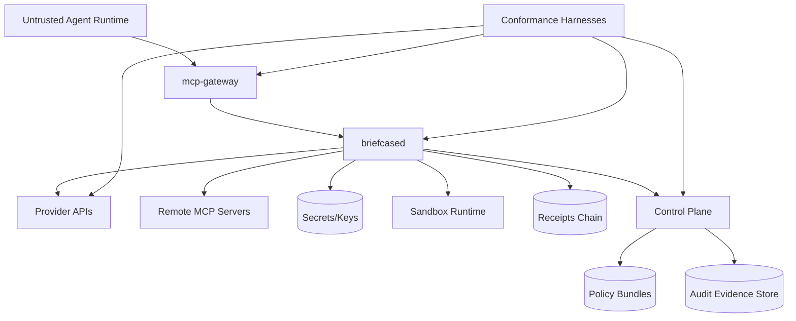

# Design: Move Credential Briefcase from reference implementation to production-grade universal agentic auth platform

## Overview

This program introduces a versioned GA architecture profile and a release qualification pipeline that converts the existing implementation into a verifiable platform standard.

The design keeps current trust boundaries intact and adds: protocol/profile versioning, interop conformance suites, platform hardening, enterprise controls, and operational evidence requirements.

## Architecture

### Component diagram (GA profile)

### Key design moves

1. Add AACP (Agentic Auth Compatibility Profile) v1.0
- Define exact behavior for MCP/gateway approval semantics, capability token fields, DPoP validation, revocation semantics, receipts/provenance envelope, and error codes.
- Bind docs and code with machine-readable profile schema and conformance tests.

2. Separate "reference" from "GA" runtime modes
- Introduce runtime profile flags: `reference`, `staging`, `ga`.
- GA mode enables strict checks by default (harder endpoint validation, hardened IPC, stricter logging policy, compatibility assertions).

3. Build verification as a first-class release artifact
- Security, interoperability, reliability, and migration evidence becomes mandatory for release promotion.

## Data model / state

### New entities

- `compat_profile` (new):
  - `name` (e.g. `aacp-v1`), `version`, `status` (`draft|stable|deprecated`), `effective_from`.
- `provider_contract_result` (new):
  - provider id, profile version, test suite version, pass/fail summary, timestamp.
- `security_evidence` (new):
  - secret-canary suite result, fuzz summary, dependency audit status, pen-test finding metadata.
- `release_qualification` (new):
  - git SHA/tag, profile version, artifact digests, signed verdict.

### Existing state upgrades

- `receipts`: include profile version and compatibility mode metadata.
- `approval requests`: include compatibility context fields for deterministic replay and auditing.
- `remote MCP server records`: include compatibility/profile requirement and auth capability metadata.

## Interfaces / APIs

### New/updated API surfaces

1. Daemon API
- Add endpoints for profile introspection and diagnostics:
  - `GET /v1/profile`
  - `GET /v1/diagnostics/compat`
  - `GET /v1/diagnostics/security`
- Extend tool/provenance responses with profile version markers.

2. Gateway behavior
- Support explicit approval token handoff path in MCP-compatible way.
- Expose standardized error payloads aligned to profile.

3. Provider gateway contract
- Versioned capability token claim schema (DPoP-bound via `cnf.jkt`).
- Standard revocation reason and replay-error taxonomy.

4. Control plane
- Signed policy bundle metadata includes profile compatibility range.
- Receipt ingestion endpoints validate profile markers and integrity chain continuity.

## File-level changes

| File | Action | Purpose |
|------|--------|---------|
| `docs/CAPABILITY_TOKENS.md` | Modify | Align docs to implemented DPoP/cnf model and profile versioning |
| `docs/ARCHITECTURE.md` | Modify | Introduce GA profile modes and compatibility guarantees |
| `docs/THREAT_MODEL.md` | Modify | Upgrade v0.1 assumptions to GA threat model and platform matrix |
| `docs/POLICY.md` | Modify | Define authoritative policy semantics under profile versions |
| `docs/RELEASING.md` | Modify | Add GA qualification/evidence gate |
| `docs/COMPATIBILITY_PROFILE.md` | Create | Normative AACP v1.0 specification |
| `docs/OPERATIONS.md` | Create | SLOs, incident classes, playbooks, rollback procedure |
| `apps/mcp-gateway/src/main.rs` | Modify | Profile-aligned approval retry and error/provenance semantics |
| `apps/briefcased/src/app.rs` | Modify | Profile mode enforcement, diagnostics endpoints, compatibility metadata |
| `apps/briefcased/src/middleware.rs` | Modify | Harden auth and transport constraints per profile mode |
| `apps/briefcased/src/remote_mcp.rs` | Modify | Profile-aware remote MCP auth/capability checks |
| `apps/briefcased/src/provider.rs` | Modify | Standardized provider contract behavior + stricter GA defaults |
| `apps/agent-access-gateway/src/main.rs` | Modify | Capability/DPoP/replay semantics conforming to AACP v1.0 |
| `apps/briefcase-control-plane/src/main.rs` | Modify | Profile-aware signed bundle and receipt validation rules |
| `crates/briefcase-core/src/types.rs` | Modify | Profile metadata structs and wire types |
| `crates/briefcase-api/src/types.rs` | Modify | API contract expansion for profile diagnostics |
| `crates/briefcase-api/src/client.rs` | Modify | Client support for profile/diagnostic APIs |
| `crates/briefcase-mcp/*` | Modify | MCP conformance behaviors for approval and error semantics |
| `crates/briefcase-receipts/*` | Modify | Receipt schema/profile markers and verification extensions |
| `crates/briefcase-risk/*` | Modify | Keep non-authoritative invariants explicit under profile modes |
| `.github/workflows/ci.yml` | Modify | Add compatibility/security qualification jobs |
| `.github/workflows/security.yml` | Modify | Expand fuzz/adversarial suites + gating policy |
| `.github/workflows/release.yml` | Modify | Enforce release qualification artifacts |
| `tests/compat/*` | Create | Cross-component conformance and interoperability tests |
| `tests/adversarial/*` | Create | Prompt injection/output poisoning/replay leak canary tests |

## Failure modes & error handling

- Unsupported profile version:
  - Handling: explicit `unsupported_profile_version` error; no silent fallback.
  - User behavior: clear remediation guidance with supported versions.

- Provider contract mismatch:
  - Handling: deny token/tool path for GA mode, emit structured diagnostics.
  - User behavior: actionable compatibility report.

- Receipt chain divergence:
  - Handling: halt ingestion sync, mark audit pipeline degraded, require operator action.
  - User behavior: read-only operations may continue based on policy; writes require explicit override.

- Control plane signature validation failure:
  - Handling: reject bundle, keep previous policy, record security event.
  - User behavior: no policy drift; operator alerted.

- Approval-token replay/mismatch:
  - Handling: deterministic deny with audit receipt + replay reason code.
  - User behavior: caller retries with new approval flow.

## Edge cases

- Mixed-version deployments during rolling upgrades.
- Provider endpoints with partial DPoP support.
- Remote MCP servers with inconsistent schema/error envelopes.
- Offline/partitioned control-plane with local policy cache.
- Multi-user host where one user process attempts to access another user’s daemon state.

## Security & privacy

- Preserve invariant: raw refresh/access/capability/payment secrets never exposed to agent-facing surfaces.
- Expand no-secrets-in-logs policy to all new diagnostics and conformance tooling.
- Ensure any new outbound network path remains deny-by-default, redirect-disabled, HTTPS-only except loopback.
- Keep AI/risk pathways strictly non-authoritative and explicitly tested.

## Performance considerations

- Compatibility checks should run at startup/session boundaries, not on every tool call when cacheable.
- Add bounded caches with strict TTLs for profile/provider metadata.
- Keep additional provenance/profile metadata compact to avoid inflating transport payloads.

## Test strategy

Map tests back to acceptance criteria.

- Unit:
  - Profile parsing/validation, capability claim validation, replay cache behavior, error taxonomy.
- Integration:
  - Gateway-daemon approval/token roundtrips, provider contract matrix, control-plane bundle validation.
- E2E:
  - Agent -> gateway -> daemon -> provider/remote MCP with GA profile on/off.
  - Adversarial flows: prompt-injection output, replay attacks, token misuse, log leakage canaries.

## Rollout / migration plan

1. Introduce profile v1.0 in shadow mode (collect diagnostics only).
2. Enable strict profile enforcement in staging.
3. Migrate provider/control-plane integrations to pass conformance suite.
4. Promote GA mode for new installs; keep reference mode behind explicit flag for development.
5. Remove deprecated behaviors after one minor-release compatibility window.
